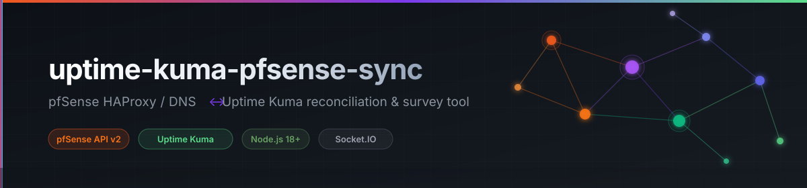
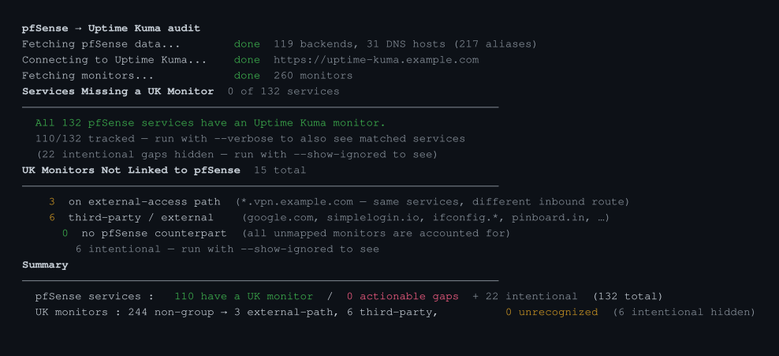

<p align="center">
  
</p>

<p align="center">
  = 18"/>
  
  
  
  
  
  
  
  
</p>

---

Audit and reconciliation tool for keeping [Uptime Kuma](https://github.com/louislam/uptime-kuma) monitors in sync with pfSense HAProxy backends and DNS host overrides. Produces a unified service map showing coverage across all three systems — HAProxy, DNS, and Uptime Kuma — in a single pass.

## How it works

The tool fetches data from pfSense (HAProxy backends + DNS resolver host overrides) and Uptime Kuma (monitor list), then builds a unified service registry keyed by first subdomain label (e.g. `nextcloud` from `nextcloud.example.com`). Each service entry shows whether it has a HAProxy backend, a public DNS alias, and an active UK monitor.

Matching is two-pass: first by monitor URL label, then by monitor name — so services where the HAProxy backend name and monitor name agree but the monitor URL uses a different DNS alias are correctly resolved.

## Setup

**Prerequisites:**
- `../pfsense-cli` — pfSense CLI (used by Makefile survey targets)
- `../uptime-kuma-sync-n-bak` — UK backup/sync/list scripts and `uptime-kuma-config.json`

```bash
cp .env.example .env
# edit .env — fill in PFSENSE_HOST, PFSENSE_API_KEY, PFSENSE_API_SECRET
# set UPTIME_KUMA_INSTANCE to a named instance in uptime-kuma-config.json
npm install
```

**.env options:**

```env
# pfSense
PFSENSE_HOST=https://pfsense.example.lan:10443
PFSENSE_API_KEY=your-api-key
PFSENSE_API_SECRET=your-api-secret
NODE_TLS_REJECT_UNAUTHORIZED=0

# Uptime Kuma — Option A: named instance from uptime-kuma-config.json
UPTIME_KUMA_INSTANCE=primary

# Uptime Kuma — Option B: direct credentials
# UPTIME_KUMA_URL=https://uptime-kuma.example.com
# UPTIME_KUMA_USER=admin
# UPTIME_KUMA_PASS=your-password
```

## Usage

```bash
make              # show help

# Reconciliation
make audit        # gap report — actionable gaps only (default)
make survey       # full inventory with match status for every service

# Target a different UK instance
make audit INSTANCE=secondary

# pfSense survey
make pf-backends              # list all HAProxy backends
make pf-backends FILTER=jelly # filter by name
make pf-dns                   # list all DNS host overrides

# Uptime Kuma survey
make uk-monitors              # list monitors grouped by group
make uk-monitors-tldr         # summary counts by group and type
make uk-backup                # backup monitors to JSON
make uk-diff                  # field-level diff: primary vs secondary

# Add a monitor
make uk-add NAME="My App" URL="http://host:8080"
make uk-add NAME="Host ping" TYPE=ping HOSTNAME=host.bub.lan GROUP=100
```

## Container

The Makefile auto-detects Podman (preferred) or Docker — no configuration needed.

```bash
make docker-build          # build image (uptime-kuma-pfsense-sync)
make docker-audit          # run gap audit in container
make docker-survey         # run full survey in container
make docker-audit INSTANCE=secondary
```

Override the engine explicitly if needed:

```bash
make docker-audit CONTAINER_ENGINE=docker
```

Or run directly:

```bash
podman compose run --rm audit           # or: docker compose run --rm audit
podman compose run --rm audit --verbose
podman compose run --rm -e UPTIME_KUMA_INSTANCE=secondary audit
```

The container reads `.env` for pfSense credentials and mounts `../uptime-kuma-sync-n-bak/uptime-kuma-config.json` read-only at `/config/uptime-kuma-config.json`.

## Audit output

<p align="center">
  
</p>

**CLI flags (passed via `node audit.js` or the Makefile targets):**

| Flag | Description |
|---|---|
| `--verbose` / `-v` | Show all services, not just gaps |
| `--show-ignored` | Include entries suppressed by `.audit-ignore.json` |

## Suppressing known-intentional gaps

Services and monitors that are intentionally unmonitored are listed in `.audit-ignore.json`. They are hidden from the default output but fully visible with `--show-ignored`.

```json
{
  "services": [
    "deploy-agent-01",
    "omv",
    "internal-svc",
    "..."
  ],
  "monitors": [
    "bypass-proxy",
    "NET - router-01",
    "..."
  ]
}
```

Common reasons to ignore a service:
- **Alias for another tracked service** — `files` is a vanity alias for `fileserver`
- **Already covered under a different name** — `MyApp` backend is monitored via the `app` DNS alias
- **Internal infrastructure** — CD pipeline agents, mesh nodes, UK instances themselves

## Domain conventions

| Domain | Purpose |
|---|---|
| `*.example.com` | Public services routed through pfSense HAProxy |
| `*.example.lan` | Internal LAN DNS — not tracked in the service registry |
| `*.vpn.example.com` | External VPN/tunnel access path — same services, different inbound route, not a gap |

HAProxy backend server addresses typically use hostnames (e.g. `service.example.lan`); static IPs are used where DNS reliability at reload time is a concern.
